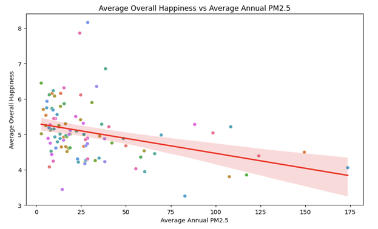
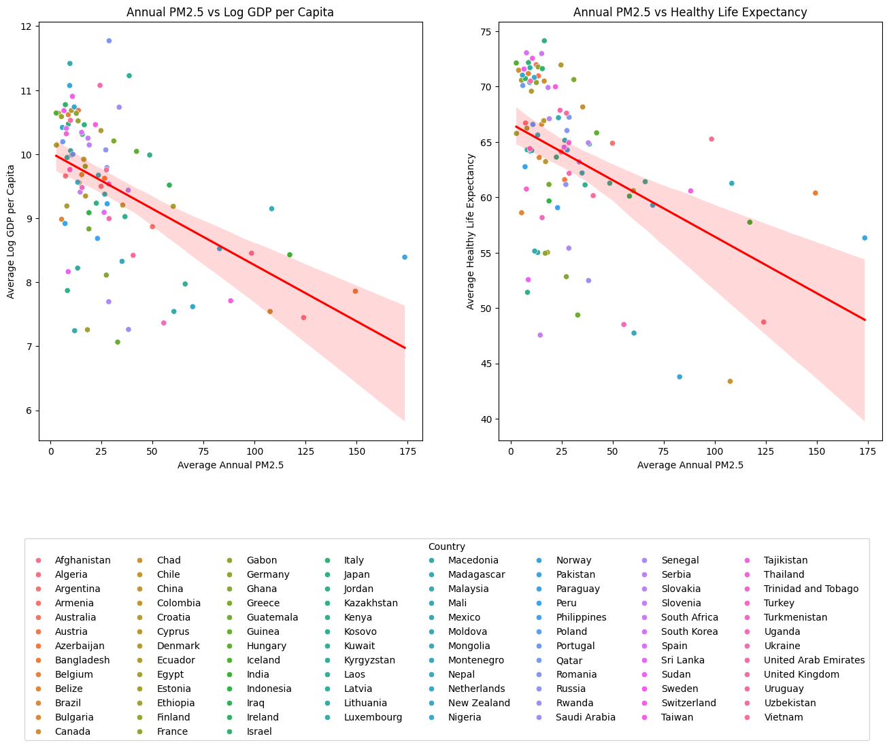
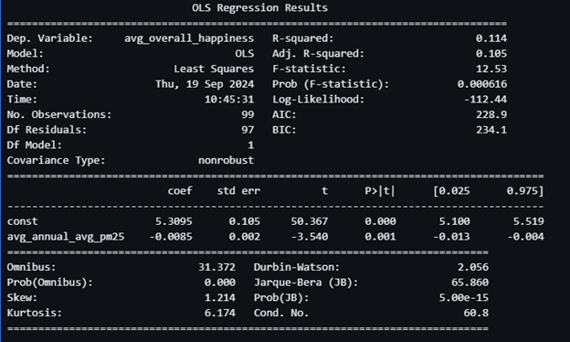

Data Analytics Capstone Project Report

# Project Overview

The primary objective of this capstone project was to explore the relationship between air quality and the happiness levels of populations across different countries. Specifically, the research question aimed to determine whether there is a correlation between the levels of fine particulate matter (PM2.5) in the air and the overall happiness scores reported in the World Happiness Report.

## Scope of the Project

- **Data Sources:** The project utilized two main datasets:
  - **Air Quality Data:** Retrieved PM2.5 measurements for various countries from the OpenAQ API.
    - **Air Quality Data:** Sourced from [OpenAQ](https://openaq.org/).
  - **Happiness Data:** Obtained happiness scores and related variables from the World Happiness Report.
    - **Happiness and Health Data:** Sourced from the [World Happiness Report dataset](https://data.world/laurel/world-happiness-report-data).
- **Time Frame:** The analysis covered multiple years to capture trends and patterns, although discrepancies in overlapping years required adjustments.

## Overview of the Solution

To address the research question, the project involved several key steps:

1. **Data Collection:** Employed different data gathering methods, including API access for air quality data and manual download for happiness data.
2. **Data Cleaning:** Handled missing values, removed implausible data points, and standardized datasets.
3. **Data Analysis:** Performed statistical correlation and regression analyses to identify relationships between variables.
4. **Visualization:** Created graphical representations using tools like Python's pandas, matplotlib, and seaborn libraries to effectively communicate findings.

Project Execution

During the execution phase, several deviations from the initial project plan occurred due to unforeseen challenges.

## Project Plan

- **Initial Plan:** The original strategy involved collecting synchronized annual data from both datasets to perform direct year-by-year comparisons.
- **Actual Execution:** Discovered that the years available in the two datasets did not align, necessitating a shift to using average values over the available years instead.

## Project Planning Methodology

- **Initial Methodology:** Adopted a linear project management approach with predefined milestones and deliverables.
- **Adaptations:** Switched to a more agile methodology to accommodate changes, allowing for iterative development and quick adjustments in response to obstacles.

## Project Timeline and Milestones

- **Adjustments:** The original timeline was extended to allocate additional time for data cleaning and restructuring due to unexpected data quality issues and non-overlapping years.
- **Milestones Affected:**
  - **Data Collection:** Extended to account for API rate limits and data availability.
  - **Data Cleaning:** Required more time to address missing values and outliers.
  - **Analysis Phase:** Adjusted to incorporate new methods suitable for the aggregated data.

# Methodology

## Data Selection and Collection Process

**Data Alignment Issues:**

- - The initial plan assumed both datasets would cover the same years for direct comparison.
    - Upon collecting the data, it was evident that the happiness data spanned from 2005 to 2016, while the air quality data was available from 2017 onwards.
    - Adjusted by calculating average values for each country across all available years in each dataset to enable comparative analysis.

**Obstacles Encountered:**

**API Limitations:**

- - Faced rate limiting when fetching data from the OpenAQ API, which required implementing delays (time.sleep()) and retry mechanisms in the data retrieval code.
    - Developed a function make_rate_limited_request() to handle rate limits and ensure successful data collection.

**Data Quality Issues:**

- - Encountered missing values and implausible data points, such as negative PM2.5 measurements and extreme outliers.
    - Implemented data-cleaning steps to remove or correct these anomalies, including filtering out negative values and using statistical methods like Z-scores to identify outliers.

**Unplanned Data Governance Issues:**

- **Data Consistency:** Had to standardize column names and data formats to ensure consistency across datasets.
- **Compliance:** Ensured adherence to the terms of service of the data providers, particularly concerning API usage limits and data privacy.

### 1\. Advantages and Limitations of the Datasets Used

**Advantages:**

- **Comprehensive Coverage:** Both datasets provided extensive global coverage, enabling a broad analysis across numerous countries.
- **Rich Variables:** The happiness dataset included multiple dimensions of well-being, allowing for a multifaceted analysis.
- **Accessibility:** The air quality data was accessible via API, facilitating automated data retrieval.

**Limitations:**

- **Temporal Misalignment:** The lack of overlapping years between datasets limited the ability to perform time-specific analyses.
- **Data Quality Variability:** Inconsistencies and missing data in both datasets reduced the reliability of some findings.
- **Limited Historical Data:** The air quality dataset had fewer historical records, constraining longitudinal analysis.

## Data Extraction and Preparation

**Processes and Tools Used:**

**Data Extraction:**

- - **Air Quality Data:** Python's requests library was used to interact with the OpenAQ API and retrieve PM2.5 measurements.
    - **Happiness Data:** I imported the Excel file using Pandas' read_excel function.

**Data Cleaning and Preparation:**

- - **Handled Missing Values:** Used pandas to identify and fill or remove missing data.
    - **Removed Implausible Values:** Filtered out negative PM2.5 readings and outliers identified through statistical methods.
    - **Standardized Column Names:** Renamed columns to ensure consistency and ease of data merging.
    - **Aggregated Data:** Calculated average values for each country due to non-overlapping years.

**Appropriateness of Processes:**

- **Python and Pandas:** Ideal for data manipulation and analysis due to their robustness and flexibility.
- **Statistical Methods:** Essential for identifying outliers and ensuring data quality.
- **Visualization Libraries:** Matplotlib and Seaborn provided powerful tools for creating insightful graphs.

## Data Analysis Process

### Methods Used to Analyze the Data

- **Correlation Analysis:** Calculated Pearson correlation coefficients to assess the strength and direction of the relationship between air quality and happiness.
- **Regression Analysis:** Performed linear regression to model the relationship and make predictions.
- **Data Visualization:** Created scatter plots with regression lines to visually represent correlations.

### Advantages and Limitations of Tools and Techniques

**Advantages:**

- **Statistical Rigor:** Provided quantitative measures to support findings.
- **Visualization Clarity:** Graphical representations make complex data accessible and understandable.
- **Efficient Data Handling:** Python libraries enabled quick manipulation of large datasets.

**Limitations:**

- **Assumption of Linearity:** May not capture non-linear relationships.
- **Data Aggregation Loss:** Averaging data potentially masks important temporal variations.
- **Limited Variables:** Focusing solely on PM2.5 may overlook other influential pollutants.

### Step-by-Step Application of Analytical Methods

1. **Data Merging:**
    - Merged the cleaned happiness and air quality datasets on the 'country' field.
    - Due to non-overlapping years, average values were used for analysis.
2. **Data Exploration:**
    - Plotted initial scatter graphs to observe potential relationships.
    - Checked distributions and identified any remaining anomalies.
3. **Correlation Calculation:**
    - Used pandas and NumPy to calculate Pearson correlation coefficients between average PM2.5 levels and average happiness scores.
4. **Regression Modeling:**
    - Applied linear regression using scikit-learn to model the relationship.
    - Evaluated the model's performance using metrics like R-squared.
5. **Assumption Verification:**
    - Checked for linearity, normality, and homoscedasticity by analyzing residual plots.
    - Ensured that the data met the requirements for valid regression analysis.

# Results

## Evaluation of the Data Analytics Project

### Evaluation of the Output of the Data Analytics Solution or Model

To assess the relationship between air quality (measured by average annual PM2.5 levels) and overall happiness across different countries, I conducted statistical analyses, including Pearson's correlation and linear regression.

**Calculating Pearson's Correlation Coefficient:**

#### Output

- Pearson's correlation coefficient: -0.338
- P-value: 0.0006

The correlation coefficient of **\-0.338** indicates a moderate negative correlation between average annual PM2.5 levels and average overall happiness. The p-value of **0.0006** is less than the significance level of 0.05, suggesting that the correlation is statistically significant.

#### Performing Linear Regression Analysis

#### Interpretation

- **The coefficient for avg_annual_avg_pm25:** The regression coefficient is **\-0.0085**, indicating that for each unit increase in average annual PM2.5 levels, the average overall happiness score decreases by approximately 0.0085 points.
- **R-squared:** The R-squared value is **0.114**, meaning that approximately 11.4% of the variability in average overall happiness can be explained by the average annual PM2.5 levels.
- **Statistical Significance:** The p-value for the avg_annual_avg_pm25 coefficient is **0.001**, which is less than 0.05, confirming that the relationship is statistically significant.

### Evaluation of the Practical Significance of the Data Analytics Solution

While the statistical analysis shows a significant negative correlation between air pollution and happiness, the practical impact per unit change is relatively modest. However, considering that PM2.5 levels can vary widely between countries, the cumulative effect can be meaningful.

**Specific Example:**

- If a country reduces its average annual PM2.5 level by **20 µg/m³**, the model predicts an increase in the average overall happiness score by:
- Change in Happiness = −0.0085 × (−20) = 0.17 points
- Although an increase of **0.17 points** may appear small, in the context of national happiness scores (which typically range from 2 to 8), this represents a notable improvement.

### Evaluation of the Overall Success and Effectiveness of the Project

The project effectively addressed the research question by identifying a statistically significant negative correlation between air quality and happiness levels across countries. Despite challenges such as non-overlapping data years and initial data quality issues, the project successfully utilized statistical methods and data visualization to uncover meaningful insights.

The inclusion of additional variables like log GDP per capita and healthy life expectancy enriched the analysis, allowing for a more comprehensive understanding of the factors influencing happiness.

## Key Takeaways of the Analysis

### Summarize the Conclusions Drawn from the Analysis

- **Negative Correlation:** There is a statistically significant moderate negative correlation between average annual PM2.5 levels and average overall happiness scores across countries.
- **Impact on Well-being:** Higher air pollution levels are associated with lower happiness scores, suggesting that air quality is an important factor affecting people's well-being.
- **Interconnected Factors:** Economic and health indicators (log GDP per capita and healthy life expectancy) also show relationships with air quality, indicating that environmental conditions are intertwined with socio-economic outcomes.

### Explain Why Your Chosen Tools and Graphical Representations Support Effective Storytelling

- **Visualization Tools:** The use of scatter plots with regression lines provided clear visual evidence of the relationships between variables. By including multiple variables in subplots, the analysis offered a comparative perspective.
- **Seaborn and Matplotlib Libraries:** These libraries enabled the creation of aesthetically pleasing and informative graphs, enhancing the communication of complex data.
- **Statistical Analysis Tools:** Utilizing pandas for data manipulation and statsmodels for regression analysis ensured accurate statistical computations, lending credibility to the findings.
- **Effective Storytelling:** The combination of statistical results with compelling visuals created a narrative that is both engaging and accessible, making it easier for stakeholders to understand and act upon the insights.

### Recommend Two Courses of Action Based on Your Findings

1. **Implement Environmental Policies to Reduce Air Pollution:**
    - Governments should prioritize reducing PM2.5 emissions through regulations targeting industrial emissions and vehicular pollution and promoting clean energy sources.
    - **Example:** Introducing stricter emission standards for factories and vehicles, investing in renewable energy infrastructure, and incentivizing the adoption of electric vehicles.
2. **Promote Public Health Initiatives:**
    - Develop programs that address the health impacts of air pollution, including public awareness campaigns and healthcare services focused on pollution-related illnesses.
    - **Example:** Launch educational campaigns to inform citizens about the health risks of air pollution and provide resources for preventive care and medical treatment.
